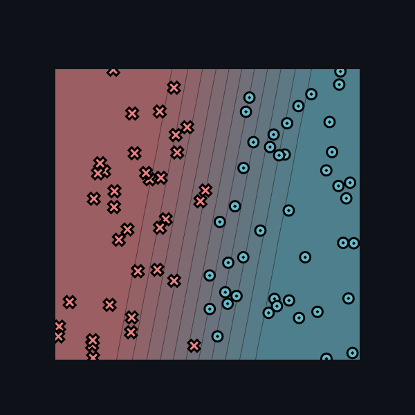

# MiniTorch Module 0

* Docs: https://minitorch.github.io/

* Overview: https://minitorch.github.io/module0.html

## Paremeters

These were the parameters chosen to obtian the visualization below.

## Visualization

The acquired visualization.
