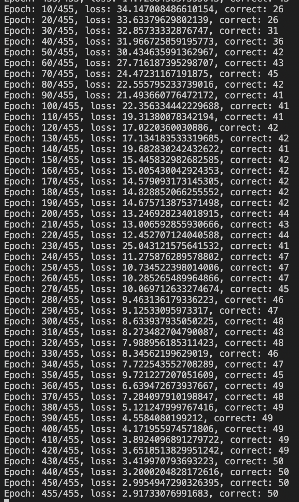

[](https://classroom.github.com/online_ide?assignment_repo_id=8657662&assignment_repo_type=AssignmentRepo)
# MiniTorch Module 2


* Docs: https://minitorch.github.io/

* Overview: https://minitorch.github.io/module2/module2/

This assignment requires the following files from the previous assignments. You can get these by running

```bash
python sync_previous_module.py previous-module-dir current-module-dir
```

The files that will be synced are:

        minitorch/operators.py minitorch/module.py minitorch/autodiff.py minitorch/scalar.py minitorch/module.py project/run_manual.py project/run_scalar.py


## Task 2.5

Below are the visualizations and settings for the first two datasets.


## Simple


<


## Diagonal


## Disclaimer

The point values were changed from 100 to 50 to experiment with the experiment with the time per epoch. In this case it made the runs faster but this observation may be anecdotal.

## Spilt


## XOR


