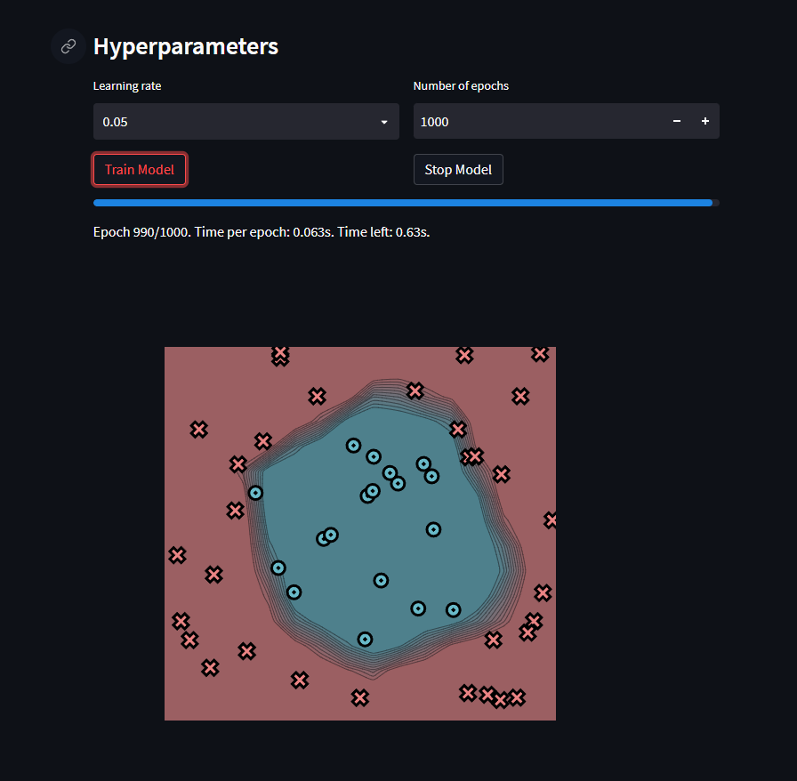

# MiniTorch Module 3


* Docs: https://minitorch.github.io/

* Overview: https://minitorch.github.io/module3.html


You will need to modify `tensor_functions.py` slightly in this assignment.

* Tests:

```
python run_tests.py
```

* Note:

Several of the tests for this assignment will only run if you are on a GPU machine and will not
run on github's test infrastructure. Please follow the instructions to setup up a colab machine
to run these tests.

This assignment requires the following files from the previous assignments. You can get these by running

```bash
python sync_previous_module.py previous-module-dir current-module-dir
```

The files that will be synced are:

        minitorch/tensor_data.py minitorch/tensor_functions.py minitorch/tensor_ops.py minitorch/operators.py minitorch/module.py minitorch/autodiff.py minitorch/module.py project/run_manual.py project/run_scalar.py project/run_tensor.py

## Task 3.1 and 3.2

[Results of the Parallel Check](https://github.com/Cornell-Tech-ML/mle-module-3-WDaugherty/blob/master/parallel_check_outputs)


## Task 3.4

Find below the comparison graph between the CPU and GPU backends that was generate from the output of the timing.py file provided by Justin.


We note that in the beginning the CPU and GPU are similiar however as size increase, the CPU take more time meanwhile the GPU is faster. It should be pointed out that this graph is not in log scale however it is not necessary.

Below is the output generated by the script and there is a text file contianing the same information within this repo.


## Task 3.5

For this task, there will be four subsections each containing the four datasets (simple, split, diagonal and xor) and a fith containing the large model for both the CPU and GPU with size set to 200. Note all in every subsection, we obtained 100% accuracy as all 50 points are correctly classified. 

### CPU with Streamlit

Note this was run with the intention of being a proof of concept and so I did not include the logs for these since the streamlit was optional. Also there is the addition of the circle dataset (ran out of time to get the spiral completly right).


#### Simple Accuracy 50/50 Time per Epoch 0.063


#### Diagonal Accuracy 50/50 Time per Epoch 0.066


#### Split Accuracy 50/50 Time per Epoch 0.060


#### Xor Accuracy 50/50 Time per Epoch 0.063


#### Circle Accuracy 50/50 Time per Epoch 0.063





### CPU with Google Colab

#### Simple Accuracy 50/50 Time per Epoch 0.33766


#### Diagonal Accuracy 50/50 Time per Epoch 0.3374


#### Split Accuracy 50/50 Time per Epoch 0.3951


#### Xor Accuracy 50/50 Time per Epoch 0.3249


[Results](https://github.com/Cornell-Tech-ML/mle-module-3-WDaugherty/blob/master/terminal_ouputs/CPU_Colab_Logs)
### GPU with Google Colab (Hidden Size 100)

#### Simple Accuracy 50/50 Time per Epoch 2.065


#### Diagonal Accuracy 50/50 Time per Epoch 2.001


#### Split Accuracy 50/50 Time per Epoch 2.0144


#### Xor Accuracy 50/50 Time per Epoch 2.0180


[Results](https://github.com/Cornell-Tech-ML/mle-module-3-WDaugherty/blob/master/terminal_ouputs/GPU_Colab_100)
### GPU with Google Colab (Hidden Size 500)

#### Simple Accuracy 50/50 Time per Epoch 2.662


#### Diagonal Accuracy 50/50 Time per Epoch 2.607


#### Split Accuracy 50/50 Time per Epoch 2.611


#### Xor Accuracy 50/50 Time per Epoch 2.622


[Results](https://github.com/Cornell-Tech-ML/mle-module-3-WDaugherty/blob/master/terminal_ouputs/GPU_Colab_500)

### Large

#### Xor CPU Large Accuracy 50/50 Time per Epoch 0.2819


#### Xor GPU Large Accuracy 50/50 Time per Epoch 2.2169


[Results](https://github.com/Cornell-Tech-ML/mle-module-3-WDaugherty/blob/master/terminal_ouputs/Large)