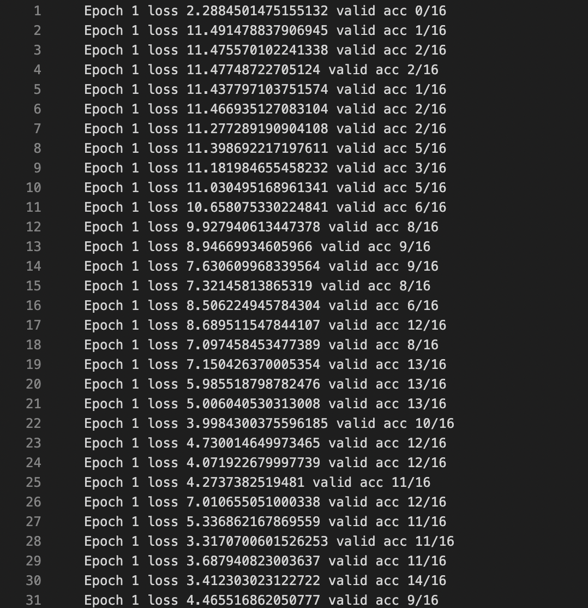
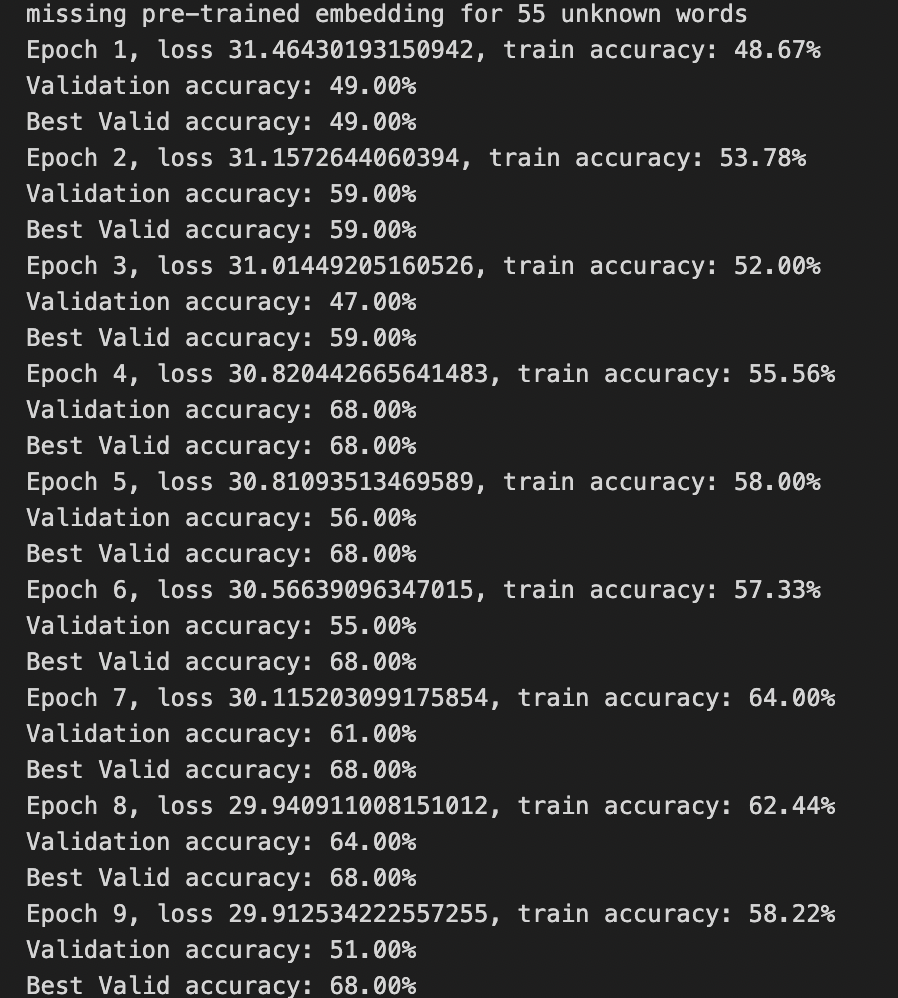

# MiniTorch Module 4


* Docs: https://minitorch.github.io/

* Overview: https://minitorch.github.io/module4.html

This module requires `fast_ops.py`, `cuda_ops.py`, `scalar.py`, `tensor_functions.py`, `tensor_data.py`, `tensor_ops.py`, `operators.py`, `module.py`, and `autodiff.py` from Module 3.


Additionally you will need to install and download the MNist library.

(On Mac, this may require installing the `wget` command)

```
pip install python-mnist
mnist_get_data.sh
```


* Tests:

```
python run_tests.py
```

This assignment requires the following files from the previous assignments. You can get these by running

```bash
python sync_previous_module.py previous-module-dir current-module-dir
```

The files that will be synced are:

        minitorch/tensor_data.py minitorch/tensor_functions.py minitorch/tensor_ops.py minitorch/fast_ops.py minitorch/cuda_ops.py minitorch/operators.py minitorch/module.py minitorch/autodiff.py minitorch/module.py project/run_manual.py project/run_scalar.py project/run_tensor.py project/run_fast_tensor.py project/parallel_check.py tests/test_tensor_general.py


## Results
See the link for the attached output logs and note that what is show bleow is the first and last epeochs within the outputlogs for both MNIST and sentiment analysis.
[Results](https://github.com/Cornell-Tech-ML/mle-module-4-WDaugherty/blob/000b22158a726097a9ff60b555f8ef72658766c4/Output_logs)


### MNIST Training Logs
For both set we get a maximum accuracy of 100%. Note there are multiple versions of MNIST.txt in the folder as there are different learning rates and double checks that the model works.


#### With learning rate 0.01 we get a final accuracy of 16/16



##### With learning rate 0.05 we get a final accuracy of 16/16


### Sentiment Training Logs
For sentiment, we note that there are two trianing outputs to validate that the model gets to over 70% validation accuracy. We note that the log output indicates the model reached a best validation accuracy of 74% for the first and 76% for the second..

#### First Script Run with 74% Validation Accuracy




#### Second Script Run 76% Validation Accuracy


